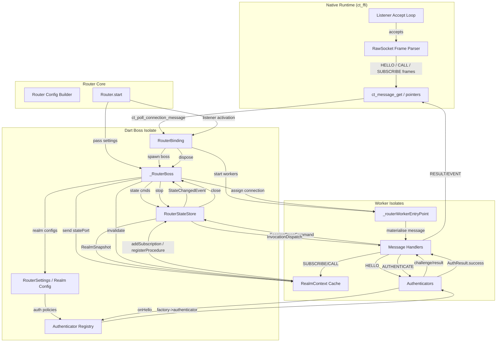

# Connectanum

Connectanum is a WAMP stack for Dart with a native transport runtime for the
router and native client paths.

This repository is the main source tree for:

- `packages/connectanum_core` - shared protocol types, serializers, and
  conformance coverage
- `packages/connectanum_client` - Dart client package, including native client
  transports
- `packages/connectanum_router` - router implementation, examples, runner, and
  integration tests
- `packages/connectanum_auth_server` - config-driven remote authentication
  helpers and server building blocks
- `packages/connectanum_bench` - benchmark harnesses and scenarios
- `native/transport` - Rust workspace for the native transport runtime

Status: active development. The project already publishes native runtime
bundles and multi-arch router images, but APIs and release conventions are
still settling.

## Quick Start

Most users want one of these two paths:

### Run The Router With Published Artifacts

1. Install the native library bundle for your host:

   ```bash
   export CONNECTANUM_NATIVE_LIB="$(dart run connectanum_router:tool/install_native.dart --tag <release-tag>)"
   ```

2. Start the router:

   ```bash
   dart run connectanum_router --config path/to/router.yaml
   ```

3. Or use the published multi-arch container image:

   - `ghcr.io/konsultaner/connectanum-router`

For a fuller deployment walkthrough, see [docs/deployment.md](docs/deployment.md).

### Work On The Codebase Locally

1. Validate the toolchain and fetch dependencies:

   ```bash
   bin/bootstrap
   ```

2. Run a fast regression pass:

   ```bash
   bin/test-fast
   ```

3. Run the full verification flow before handoff:

   ```bash
   bin/verify
   ```

4. Build or test the native workspace directly when needed:

   ```bash
   cd native/transport
   cargo test
   cargo build -p ct_ffi --release
   # coverage (requires cargo-llvm-cov)
   cargo llvm-cov
   ```

   When working on the router or client packages, Dart 3.10+ build hooks will
   compile `ct_ffi` automatically during `dart run`/`dart test` as long as a
   Rust toolchain is available.

## Examples

Start with the shortest runnable entrypoint for the workflow you need:

- [docs/examples.md](docs/examples.md) - curated examples for progressive
  results, call cancellation, lazy payload APIs, and router startup
- [packages/connectanum_client/example/main.dart](packages/connectanum_client/example/main.dart)
  - basic client connection, registration, call, and publish flow
- [packages/connectanum_router/example/main.dart](packages/connectanum_router/example/main.dart)
  - local router with ticket, WAMP-CRA, SCRAM, and remote-auth demo providers
- [packages/connectanum_router/example/remote_websocket.dart](packages/connectanum_router/example/remote_websocket.dart)
  - router + WebSocket listener + in-process remote auth server
- [docs/router_example.yaml](docs/router_example.yaml) - minimal config starter

## Runtime Semantics

### Call Cancellation

Client `Session.call...` APIs accept an optional `cancelCompleter`. Completing
that completer sends a WAMP `CANCEL` using one of the currently supported
modes:

- `skip` - stop waiting locally without interrupting the callee
- `killnowait` - interrupt the callee and return cancellation to the caller
  immediately
- `kill` - interrupt the callee and wait for the callee-side cancellation/error
  acknowledgement before completing the caller

`killall` is not part of the current public contract.

### Graceful Drain

`RouterBinding.drain()` is the graceful shutdown entrypoint for the router. It:

- closes native listener sockets first so no new accepts enter the pipeline
- lets workers finish session shutdown and GOODBYE/close handling
- flips `/healthz` to `503 draining` while shutdown is in progress when the
  OpenMetrics server is enabled

`RouterBinding.dispose()` already calls `drain()` before tearing down the boss,
internal sessions, and metrics server, so CLI/process shutdown uses the same
path.

### Lazy Payload And Zero-Copy Boundaries

Connectanum preserves encoded payload bytes when the transport, serializer, and
API shape allow it. The relevant public entrypoints are:

- `LazyMessagePayload`
- `Session.callSingleLazyPayload(...)`
- `Session.subscribeLazyPayloadHandler(...)`
- `Session.registerLazyPayloadHandler(...)`
- `Session.publishLazyPayload(...)`

That is not a blanket promise that every path is zero-copy. Same-serializer and
native fast paths can usually keep payload bytes lazy until first access; mixed
serializers, unsupported metadata shapes, or materialized APIs may still decode
and re-encode payloads.

## Releases And Published Artifacts

### Native Runtime Bundles

The [Native Artifacts workflow](.github/workflows/native-artifacts.yml)
publishes prebuilt `ct_ffi` bundles as:

- `ct-ffi-<host-triple>.tar.gz`
- `*.sha256`
- `*.manifest.json`
- `*.sigstore.json`

Current GitHub-hosted release targets:

- Linux x64 (`x86_64-unknown-linux-gnu`)
- Linux arm64 (`aarch64-unknown-linux-gnu`)
- macOS arm64 (`aarch64-apple-darwin`)
- macOS Intel (`x86_64-apple-darwin`)
- Windows x64 (`x86_64-pc-windows-msvc`)

Maintainers can preview the exact GitHub Release title, asset list, and notes
without publishing by manually dispatching the `Native Artifacts` workflow with
`release_tag=<tag>` and `dry_run=true`. The run still builds and verifies the
native matrix, then uploads a `native-release-preview` artifact containing
`release-metadata.txt` and `release-notes.md`; no GitHub Release is created or
updated.

The main `CI` workflow intentionally does not publish raw per-test metrics
snapshots. Release-facing native artifacts come from this workflow and GitHub
Releases, while performance/transport evidence comes from the dedicated bench
artifact and gate outputs.

The root scripts auto-detect the standard release location for `ct_ffi` and set
`CONNECTANUM_NATIVE_LIB` when possible. If you are using a prebuilt library in a
different location, export `CONNECTANUM_NATIVE_LIB` yourself before running
tests or the router runner. The package-local build hooks also honor that same
variable and will bundle the referenced library instead of invoking Cargo. For
deployments that intentionally provide `ct_ffi` as a system/shared library, set
`CONNECTANUM_SKIP_NATIVE_BUILD=1` to disable Cargo in the build hooks and rely
on `CONNECTANUM_NATIVE_LIB` or the platform loader search path at runtime.

If you want the hooks to acquire a hosted prebuilt bundle automatically, export
`CONNECTANUM_NATIVE_RELEASE_TAG=<tag>` before `dart run` / `dart test`. The
hooks then download `ct-ffi-<host-triple>.tar.gz` plus its `.sha256` file from
GitHub Releases, verify the checksum, extract the bundle, and stage the native
library without requiring a local Rust toolchain. Use
`CONNECTANUM_NATIVE_RELEASE_REPOSITORY=<owner/repo>` to override the default
release source (`konsultaner/connectanum-dart`).

If you prefer an explicit prefetch step instead of hook-managed downloads, use:

```bash
dart run connectanum_router:tool/install_native.dart --tag <release-tag>
dart run connectanum_client:tool/install_native.dart --tag <release-tag>
```

Each command downloads the host-native bundle into
`.dart_tool/connectanum/native/<host-triple>/` and prints the installed library
path on stdout.

Verification options:

- GitHub attestation:
  `gh attestation verify path/to/ct-ffi-<host-triple>.tar.gz -R konsultaner/connectanum-dart`
- Detached Sigstore bundle:

  ```bash
  cosign verify-blob path/to/ct-ffi-<host-triple>.tar.gz \
    --bundle path/to/ct-ffi-<host-triple>.tar.gz.sigstore.json \
    --certificate-identity "https://github.com/konsultaner/connectanum-dart/.github/workflows/native-artifacts.yml@refs/tags/<tag>" \
    --certificate-oidc-issuer https://token.actions.githubusercontent.com
  ```

For manual workflow runs, use the actual workflow ref that emitted the bundle
instead of the tag-based identity above.

### Router Container Image

The [Router Image workflow](.github/workflows/router-image.yml) publishes
multi-arch router images to `ghcr.io/konsultaner/connectanum-router`.

- `v*` tags publish `linux/amd64` and `linux/arm64`
- stable SemVer tags also publish `:latest`
- manual workflow dispatch can publish a one-off validation tag

## Maintainer Workflow

The repository also carries a small amount of checked-in project state so long
running maintainer and automation sessions can resume cleanly:

- `AGENTS.md` contains the durable operating rules for autonomous runs
- `docs/project_state.md` is the current-state file to read first when resuming
- `docs/exec-plans/` stores one plan per substantial task
- `ROADMAP_NEXT.md` holds milestone candidates

### External Codex Loop On macOS

The Codex app heartbeat runner is useful for lightweight continuation, but a
local `launchd` job gives Codex the same broader machine access as a normal
interactive CLI run. On this machine the recurring worker is installed as:

- LaunchAgent plist:
  `~/Library/LaunchAgents/com.konsultaner.connectanum-dart.codex-loop.plist`
- Worker script:
  `~/.codex/launchd/connectanum-dart-loop.sh`
- Durable prompt:
  `~/.codex/launchd/connectanum-dart-loop-prompt.txt`
- Manual attach helper:
  `~/.codex/launchd/connectanum-dart-attach.sh`

The worker runs every 20 minutes and uses:

```bash
codex exec resume --last --dangerously-bypass-approvals-and-sandbox
```

Useful commands:

```bash
# start / load the recurring worker
launchctl bootstrap gui/$(id -u) ~/Library/LaunchAgents/com.konsultaner.connectanum-dart.codex-loop.plist

# force an immediate run
launchctl kickstart -k gui/$(id -u)/com.konsultaner.connectanum-dart.codex-loop

# stop / unload it
launchctl bootout gui/$(id -u) ~/Library/LaunchAgents/com.konsultaner.connectanum-dart.codex-loop.plist

# attach manually to the latest Codex session
~/.codex/launchd/connectanum-dart-attach.sh
```

Logs and the latest final message are written to:

- `~/.codex/logs/connectanum-dart-loop/launchd.stdout.log`
- `~/.codex/logs/connectanum-dart-loop/launchd.stderr.log`
- `~/.codex/logs/connectanum-dart-loop/last-message.txt`

## Router Authentication Reference

- [Router credential guidelines](docs/router_auth_credentials.md) – how to store CRA/SCRAM credentials without keeping plaintext secrets, plus helper snippets for generating derived keys.
- [Remote authentication interoperability](docs/remote_auth_interop.md) – realm/procedure contract for integrating with the Java remote auth service.
- Remote delegate failover – register multiple delegates via `RemoteAuthenticatorRegistry.register(delegate, id: ...)` and list them in authenticator options using `"delegates": ["primary", "secondary"]` to enable automatic failover.
- Remote auth server building blocks – see [`packages/connectanum_auth_server`](packages/connectanum_auth_server) for a config-driven implementation of the remote authentication contract so you can run the same authenticators out of process.
- Example walkthrough: [`packages/connectanum_router/example/main.dart`](packages/connectanum_router/example/main.dart) – demonstrates hashed credential providers, `CredentialRejection` error signalling, and a remote authenticator delegate.
- WebSocket + remote auth demo: [`packages/connectanum_router/example/remote_websocket.dart`](packages/connectanum_router/example/remote_websocket.dart) – starts a router with WebSocket configuration and delegates authentication to the in-process auth server.

## Router Data Flow

The router uses a multi-layered architecture combining the native transport
runtime, a boss/worker isolate model, and a central state store. The following
Mermaid diagram illustrates the main components and message flow in detail:



Key points:

- The native runtime accepts TCP connections, parses WAMP RawSocket frames, and
  exposes them via FFI callbacks.
- `Router.start` builds a router binding, passes in `RouterSettings`, and spawns
  `_RouterBoss` plus worker isolates.
- `_RouterBoss` owns the central `RouterStateStore`, manages connection
  assignment, and holds realm configuration plus the authenticator registry.
- Worker isolates materialize native messages, drive authentication using
  pluggable authenticators, and call into `RealmContext` to interact with the
  store (subscriptions, registrations, snapshots, etc.).
- All state mutations flow through `RouterStateStore`, which enforces realm
  limits, tracks sessions, subscriptions, procedures, and dispatches events back
  to the boss/metrics layer.

## Design Notes

- The public lazy-payload APIs are intentional. If an integration needs to keep
  encoded WAMP payload bytes intact across client, router, or internal-session
  boundaries, use those APIs instead of the materialized convenience wrappers.
- Advanced-profile cancellation currently supports `skip`, `kill`, and
  `killnowait`. If `killall` is added later, it should be documented as a new
  contract rather than assumed implicitly.
