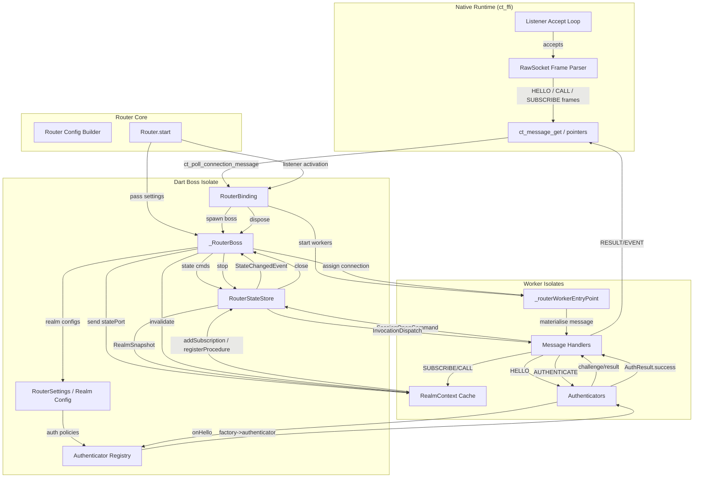

# connectanum-dart Monorepo

This repository hosts the next generation of the connectanum WAMP stack. It is
split into a Dart workspace that keeps the client and upcoming router code
side-by-side, and a Rust workspace that will provide the native transport
runtime.

- `packages/connectanum_dart` – Dart package containing the existing WAMP
  client and the new router modules (work in progress).
- `native/transport` – Rust workspace for the native networking runtime
  (currently a skeleton).

## Getting Started

1. Install the Dart SDK locally (or run `./codex.sh`).
2. Fetch dependencies and run tests from the Dart package:

   ```bash
   cd packages/connectanum_dart
   dart pub get
   dart test
   ```

3. Build or test the native workspace (Linux support is implemented first):

   ```bash
   cd native/transport
   cargo test
   cargo build -p ct_ffi --release
   # coverage (requires cargo-llvm-cov)
   cargo llvm-cov
   ```

For additional package level documentation see
`packages/connectanum_dart/README.md`.

## Router Authentication Reference

- [Router credential guidelines](docs/router_auth_credentials.md) – how to store CRA/SCRAM credentials without keeping plaintext secrets, plus helper snippets for generating derived keys.
- [Remote authentication interoperability](docs/remote_auth_interop.md) – realm/procedure contract for integrating with the Java remote auth service.
- Remote delegate failover – register multiple delegates via `RemoteAuthenticatorRegistry.register(delegate, id: ...)` and list them in authenticator options using `"delegates": ["primary", "secondary"]` to enable automatic failover.
- Remote auth server building blocks – see [`packages/connectanum_auth_server`](packages/connectanum_auth_server) for a config-driven implementation of the remote authentication contract so you can run the same authenticators out of process.
- Example walkthrough: [`packages/connectanum_router/example/main.dart`](packages/connectanum_router/example/main.dart) – demonstrates hashed credential providers, `CredentialRejection` error signalling, and a remote authenticator delegate.
- WebSocket + remote auth demo: [`packages/connectanum_router/example/remote_websocket.dart`](packages/connectanum_router/example/remote_websocket.dart) – starts a router with WebSocket configuration and delegates authentication to the in-process auth server.

## Router Data Flow

The router uses a multi-layered architecture combining the native transport
runtime, a boss/worker isolate model, and a central state store. The following
Mermaid diagram illustrates the main components and message flow in detail:



Key points:

- The native runtime accepts TCP connections, parses WAMP RawSocket frames, and
  exposes them via FFI callbacks.
- `Router.start` builds a router binding, passes in `RouterSettings`, and spawns
  `_RouterBoss` plus worker isolates.
- `_RouterBoss` owns the central `RouterStateStore`, manages connection
  assignment, and holds realm configuration plus the authenticator registry.
- Worker isolates materialize native messages, drive authentication using
  pluggable authenticators, and call into `RealmContext` to interact with the
  store (subscriptions, registrations, snapshots, etc.).
- All state mutations flow through `RouterStateStore`, which enforces realm
  limits, tracks sessions, subscriptions, procedures, and dispatches events back
  to the boss/metrics layer.

## Design Notes

- Advanced-profile call cancellation modes (`kill`, `killnowait`, `killall`) will
  be implemented so that cancellers can wait for the callee to perform any
  required cleanup. This guarantees that subsequent processing shuts down
  gracefully instead of leaving background work dangling.
```
