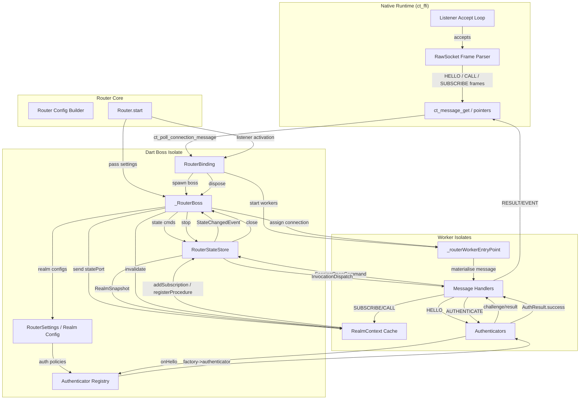

# connectanum-dart Monorepo

This repository hosts the next generation of the connectanum WAMP stack. It is
split into a Dart workspace that keeps the client and upcoming router code
side-by-side, and a Rust workspace that will provide the native transport
runtime.

- `packages/connectanum_core` - shared WAMP protocol types, serializers, and
  conformance coverage.
- `packages/connectanum_client` - Dart client package, including native client
  transports.
- `packages/connectanum_router` - router implementation, examples, runner, and
  integration tests.
- `packages/connectanum_auth_server` - config-driven remote authentication
  helpers and server building blocks.
- `packages/connectanum_bench` - benchmark harnesses and scenarios.
- `native/transport` - Rust workspace for the native transport runtime backing
  the router and native client transports.

## Getting Started

1. Validate the local toolchain and fetch workspace dependencies:

   ```bash
   bin/bootstrap
   ```

2. Run a fast local regression pass:

   ```bash
   bin/test-fast
   ```

3. Run the full verification flow before handoff:

   ```bash
   bin/verify
   ```

4. Build or test the native workspace directly when needed:

   ```bash
   cd native/transport
   cargo test
   cargo build -p ct_ffi --release
   # coverage (requires cargo-llvm-cov)
   cargo llvm-cov
   ```

   When working on the router or client packages, Dart 3.10+ build hooks will
   compile `ct_ffi` automatically during `dart run`/`dart test` as long as a
   Rust toolchain is available.

The root scripts auto-detect the standard release location for `ct_ffi` and set
`CONNECTANUM_NATIVE_LIB` when possible. If you are using a prebuilt library in a
different location, export `CONNECTANUM_NATIVE_LIB` yourself before running
tests or the router runner. The package-local build hooks also honor that same
variable and will bundle the referenced library instead of invoking Cargo. For
deployments that intentionally provide `ct_ffi` as a system/shared library, set
`CONNECTANUM_SKIP_NATIVE_BUILD=1` to disable Cargo in the build hooks and rely
on `CONNECTANUM_NATIVE_LIB` or the platform loader search path at runtime.

Prebuilt Linux/macOS `ct_ffi` bundles are also available from the dedicated
GitHub Actions workflow in [native-artifacts.yml](.github/workflows/native-artifacts.yml).
Manual runs always upload workflow artifacts, and release-tag runs publish the
same `ct-ffi-<host-triple>.tar.gz` bundles to GitHub Releases. Extract the
archive for your host and point `CONNECTANUM_NATIVE_LIB` at the included
library. The release workflow also publishes GitHub artifact attestations for
the archive/checksum/manifest set, so a downloaded archive can be verified with
`gh attestation verify path/to/ct-ffi-<host-triple>.tar.gz -R konsultaner/connectanum-dart`.
Detached offline signature files are not shipped yet.

## Codex-Friendly Workflow

- `AGENTS.md` contains the durable operating rules for autonomous runs.
- `docs/project_state.md` is the small current-state file Codex should read
  first when resuming work.
- `docs/exec-plans/` stores one plan per substantial task so long-running work
  can continue without rebuilding context from scratch.
- `ROADMAP_NEXT.md` holds milestone candidates; `ROADMAP.md` and `STRUCTURE.md`
  are reference material rather than required startup reading.

### External Codex Loop On macOS

The Codex app heartbeat runner is useful for lightweight continuation, but a
local `launchd` job gives Codex the same broader machine access as a normal
interactive CLI run. On this machine the recurring worker is installed as:

- LaunchAgent plist:
  `~/Library/LaunchAgents/com.konsultaner.connectanum-dart.codex-loop.plist`
- Worker script:
  `~/.codex/launchd/connectanum-dart-loop.sh`
- Durable prompt:
  `~/.codex/launchd/connectanum-dart-loop-prompt.txt`
- Manual attach helper:
  `~/.codex/launchd/connectanum-dart-attach.sh`

The worker runs every 20 minutes and uses:

```bash
codex exec resume --last --dangerously-bypass-approvals-and-sandbox
```

Useful commands:

```bash
# start / load the recurring worker
launchctl bootstrap gui/$(id -u) ~/Library/LaunchAgents/com.konsultaner.connectanum-dart.codex-loop.plist

# force an immediate run
launchctl kickstart -k gui/$(id -u)/com.konsultaner.connectanum-dart.codex-loop

# stop / unload it
launchctl bootout gui/$(id -u) ~/Library/LaunchAgents/com.konsultaner.connectanum-dart.codex-loop.plist

# attach manually to the latest Codex session
~/.codex/launchd/connectanum-dart-attach.sh
```

Logs and the latest final message are written to:

- `~/.codex/logs/connectanum-dart-loop/launchd.stdout.log`
- `~/.codex/logs/connectanum-dart-loop/launchd.stderr.log`
- `~/.codex/logs/connectanum-dart-loop/last-message.txt`

## Router Authentication Reference

- [Router credential guidelines](docs/router_auth_credentials.md) – how to store CRA/SCRAM credentials without keeping plaintext secrets, plus helper snippets for generating derived keys.
- [Remote authentication interoperability](docs/remote_auth_interop.md) – realm/procedure contract for integrating with the Java remote auth service.
- Remote delegate failover – register multiple delegates via `RemoteAuthenticatorRegistry.register(delegate, id: ...)` and list them in authenticator options using `"delegates": ["primary", "secondary"]` to enable automatic failover.
- Remote auth server building blocks – see [`packages/connectanum_auth_server`](packages/connectanum_auth_server) for a config-driven implementation of the remote authentication contract so you can run the same authenticators out of process.
- Example walkthrough: [`packages/connectanum_router/example/main.dart`](packages/connectanum_router/example/main.dart) – demonstrates hashed credential providers, `CredentialRejection` error signalling, and a remote authenticator delegate.
- WebSocket + remote auth demo: [`packages/connectanum_router/example/remote_websocket.dart`](packages/connectanum_router/example/remote_websocket.dart) – starts a router with WebSocket configuration and delegates authentication to the in-process auth server.

## Router Data Flow

The router uses a multi-layered architecture combining the native transport
runtime, a boss/worker isolate model, and a central state store. The following
Mermaid diagram illustrates the main components and message flow in detail:



Key points:

- The native runtime accepts TCP connections, parses WAMP RawSocket frames, and
  exposes them via FFI callbacks.
- `Router.start` builds a router binding, passes in `RouterSettings`, and spawns
  `_RouterBoss` plus worker isolates.
- `_RouterBoss` owns the central `RouterStateStore`, manages connection
  assignment, and holds realm configuration plus the authenticator registry.
- Worker isolates materialize native messages, drive authentication using
  pluggable authenticators, and call into `RealmContext` to interact with the
  store (subscriptions, registrations, snapshots, etc.).
- All state mutations flow through `RouterStateStore`, which enforces realm
  limits, tracks sessions, subscriptions, procedures, and dispatches events back
  to the boss/metrics layer.

## Design Notes

- Advanced-profile call cancellation modes (`kill`, `killnowait`, `killall`) will
  be implemented so that cancellers can wait for the callee to perform any
  required cleanup. This guarantees that subsequent processing shuts down
  gracefully instead of leaving background work dangling.
