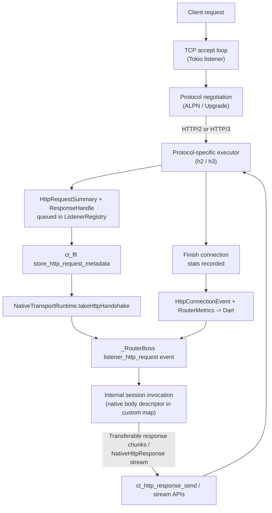

# Router Architecture & Data Flow

This document summarizes the current routing stack, the primary code locations, and the major initiatives already tracked in `ROADMAP.md`. The diagrams use Mermaid to visualize both the layered components and a typical HTTP ingestion workflow.

## Layered View

```mermaid
graph LR
    subgraph Clients
        A["Web/WAMP Clients"]
    end
    subgraph OS
        B["TCP/UDP Sockets"]
    end
    subgraph NativeRuntime["ct_core (Rust)"]
        C["Tokio Runtime\n(native/transport/ct_core/src/lib.rs)"]
        D["Negotiation Layer\n(RawSocket/WebSocket/HTTP)"]
        E["Protocol Executors\nHTTP1/2/3, QUIC, h2"]
        F["Streaming & Metrics\nhttp_stream.rs, http_body.rs"]
    end
    subgraph FFI["ct_ffi"]
        G["State Stores & Handles\nnative/transport/ct_ffi/src/runtime"]
    end
    subgraph DartRuntime["connectanum_router (Dart)"]
        H["NativeTransportRuntime\npackages/connectanum_router/lib/src/native"]
        I["_RouterBoss + Workers\nrouter_instance/router_boss.dart"]
        J["RouterStateStore & Metrics"]
        K["Application Handlers\n(worker isolates)"]
    end

    A --> B --> C --> D --> E --> F --> G --> H --> I --> K
    I --> J
    K -->|Responses/Events| I --> H --> G --> F
```

### Current Responsibilities

- **Tokio runtime & ListenerRegistry (`ct_core/src/lib.rs`)**  
  Binds sockets, negotiates protocols, and spawns per-protocol tasks (RawSocket, WebSocket, HTTP/1.1 handshakes, HTTP/2 via `h2`, HTTP/3 via `quinn + h3`). RawSocket/WebSocket connections run a heartbeat monitor (PING/PONG), use bounded inbound/outbound queues (backpressure), and can be closed explicitly via FFI; every HTTP connection gets a `HttpConnectionStats` instance that records idle/body timeouts, GOAWAY, and backpressure depth; HTTP/3 body timeouts close the QUIC connection to avoid `h3-quinn` stop-sending races. The HTTP/2 server path now applies explicit `h2` flow-control and stream/window limits, and the HTTP/3 server path applies explicit QUIC transport tuning (larger stream/connection windows, send window, datagram buffers, keep-alive) instead of pure library defaults tuned for a much lower-bandwidth link.
  Listeners can be closed independently via `close_listener` (exposed as `ct_listener_close`) so deployments can stop accepting new connections while existing sessions drain.

- **Streaming primitives (`http_stream.rs`, `http_body.rs`)**  
  Provide zero-copy handles for inbound bodies and outbound responses. HTTP/1.1 ingress now parses headers/bodies with `BytesMut`, keeps buffered bodies as `Bytes` inside `HttpBodyHandle`, and preserves prefetched bytes when switching from handshake parsing to the streaming reader. HTTP/2 and HTTP/3 readers use the shared `StreamingBodyState` and now enqueue received `Bytes` chunks directly instead of cloning into temporary `Vec`s, while decoded HTTP/2/HTTP/3 request metadata stays byte-backed across `ct_core -> ct_ffi` instead of being flattened to `String`s and recopied for FFI storage. Response writers use bounded Tokio channels sized by `RESPONSE_STREAM_BUFFER`.

- **FFI surface (`ct_ffi/src/runtime`)**  
  Stores every handshake/body/stream in lock-free maps and exposes them as integer handles (`ct_connection_take_http_handshake`, `ct_http_body_stream_read`, etc.). Lifecycle telemetry (`ct_connection_poll_http_event`) and aggregate counters (`ct_router_metrics_snapshot`) flow through the same layer. WebSocket upgrades now expose the negotiated subprotocol via `ct_connection_websocket_protocol` so Dart can forward it to workers/metrics. Test-only helpers (feature `ffi-test`) let us seed HTTP/3 handshakes/events directly from Rust integration tests.

- **Dart bindings (`packages/connectanum_router/lib/src/native`)**  
  `NativeTransportRuntime` loads the shared library, wires callbacks, and converts raw structs into Dart objects (`NativeHttpHandshake`, `NativeHttpConnectionEvent`, `NativeRouterMetrics`). The runtime is protocol-agnostic: any new native symbol must be added to `ffi_bindings.dart`. The Dart 3.10+ build hook in `packages/connectanum_router/hook/build.dart` compiles `ct_ffi` during `dart run`/`dart test`, and `NativeLibraryLoader` prefers artifacts under `.dart_tool/hooks_runner` before falling back to `native/transport/target` or `CONNECTANUM_NATIVE_LIB`.
  Shutdown/drain paths call `closeListener` (backed by `ct_listener_close`) before worker drain so accept queues can’t grow unbounded during graceful shutdown.

- **Client native transports (`packages/connectanum_client/lib/src/transport/native`)**  
  `NativeClientRuntime` is a package-local FFI wrapper over the same `ct_ffi` library, exposing `NativeRawSocketTransport` and `NativeWebSocketTransport` without depending on router internals. It resolves the shared library from `CONNECTANUM_NATIVE_LIB`, `.dart_tool/hooks_runner`, or local build outputs, retains inbound native message handles until the Dart message wrapper is finalized, and keeps the public client transport API stable through conditional `io`/`none` exports. The client build hook writes a package-specific `connectanum_client_ct_ffi` artifact so applications that depend on both router and client do not collide on native-asset names. `ct_ffi` now exports typed metadata for common inbound WAMP messages, so the native client can bind `Published` / `Subscribed` / `Registered` / `Unregistered` plus simple `Event` / `Result` / `Invocation` messages directly in Dart without re-deserializing the full frame unless custom details force a fallback. Native transports also expose a session-only inbound envelope for hot `Event` / `Result` / `Invocation` traffic, and `connectanum_core` now provides a `LazyMessagePayload` object so backend-style flows can hold borrowed encoded args/kwargs bytes and only decode them if the handler actually needs Dart objects. Matching JSON/MessagePack/CBOR serializers now reuse those encoded slices on outbound payload serialization and no longer copy whole detail maps just to peel known `INVOCATION` / `RESULT` / `EVENT` keys off the inbound path. The CBOR serializer path now preserves PPT option fields on outbound `PUBLISH` / `CALL` / `YIELD` messages as well, and the shared lazy-payload layer carries “already decoded PPT” state so materialized event/result/invocation objects can be converted back into lazy payload views without a second unpack attempt. On top of the transport, `Session` now routes request/reply traffic by protocol ids, offers `callSingle(...)` / `callSinglePayload()` / `callSingleLazyPayload()` for non-progressive RPC fast paths plus `subscribeHandler(...)` / `subscribePayloadHandler(...)` / `subscribeLazyPayloadHandler(...)` and `registerHandler(...)` / `registerPayloadHandler(...)` / `registerLazyPayloadHandler(...)` for backend-style direct callbacks, decodes subscription events once on ingress, exposes `Subscribed.onEvent(...)` / `onEventPayload(...)` / `onLazyEventPayload(...)` as the direct pub/sub callback paths for backend-style consumers, propagates async callee failures back as WAMP `ERROR`s, and leaves `Subscribed` / `Registered` stream controllers lazy so stream-based Flutter consumers still work without forcing backend-style callers through eager broadcast-controller allocation.

- **Router boss/worker (`packages/connectanum_router/lib/src/router/router_instance/router_boss.dart`)**  
  The boss isolate accepts connections, assigns them to workers, drains queued HTTP/1.1, HTTP/2, and HTTP/3 requests on active connections, watches lifecycle events, and now emits a `router_metrics` event whenever the aggregated counters change. Workers own the actual WAMP sessions and execute application handlers.
  Zero-copy publish forwarding stays behind `CONNECTANUM_FORWARD_NATIVE_PUBLISH` (compile-time define or runtime env var); boss telemetry sends are wrapped so tracing failures can’t block forwarding/handle release in the worker.
  GOAWAY/backpressure alerts can throttle listener accepts based on configurable thresholds (`metrics.backpressure` / `metrics.transport_alerts`); detailed GOAWAY reasons are surfaced in both native and Dart runtime tests. The boss also keeps the latest per-listener alert snapshot (last reason/category, remaining throttle cooldown) so metrics consumers can inspect current alert state instead of only cumulative counters. Its main loop now wakes immediately after busy passes or worker/state events instead of always sleeping `pollInterval`, which keeps HTTP drain/dispatch responsive under sustained load.

- **Internal-session isolate hop (`packages/connectanum_router/lib/src/router/http/http_context.dart`, `router_internal_session.dart`, `router_worker_session.dart`)**  
  Internal-session HTTP invocations now carry borrowed native body descriptors (handle + length + streaming flag + library path) instead of copied request bytes, so handlers can either materialize on demand or stream directly from the native body handle inside the receiving isolate. Large non-streaming response chunks still use `TransferableTypedData` when they cross isolates, but `context.streamResponse()` now prefers a borrowed native response-stream descriptor: the callee isolate opens the native stream once, writes body chunks directly, and sends only a final completion result back through the shared call lifecycle instead of one WAMP progress payload per chunk. The same isolate hop now preserves WAMP `LazyMessagePayload` descriptors too: worker sessions and internal sessions forward encoded args/kwargs bytes plus serializer hints for internal publish/call/event/invocation/result traffic, only decoding into Dart `List` / `Map` payloads when handlers or stream consumers actually ask for them.

## HTTP Workflow (current)

- **Metrics loop:** Every connection teardown pushes an event into `ListenerRegistry.connection_events`. The new `http_metrics_snapshot()` aggregates totals across the runtime; `ct_router_metrics_snapshot` lifts it to Dart, where `_RouterBoss` emits a `router_metrics` event on change.  
  Per-listener/protocol breakdowns are exposed via `http_metrics_snapshot_with_breakdown()` and cached in the boss telemetry stream so `_MetricsService` can publish them over OpenMetrics/WAMP or the HTTP metrics endpoint (with optional auth token) for Prometheus scraping. The boss also raises `listener_backpressure_alert` / `listener_transport_alert` events and throttles accepts based on the configurable `metrics.backpressure` and `metrics.transport_alerts` thresholds. Snapshot JSON now includes active throttle state and last-alert metadata, while OpenMetrics exports throttle gauges for Prometheus/Grafana.
- **Backpressure accounting:** Whenever pending HTTP queues exceed one item, `HttpConnectionStats::record_backpressure` increments the counter and tracks the largest depth. This information is available both per-event and in the aggregate snapshot.

## Planned Enhancements
| Roadmap Theme | Description | Status |
| --- | --- | --- |
| Multi-protocol listener stack | Unified accept loop with ALPN/Upgrade, surfacing serializer/subprotocol data. | 🔄 Planned (ROADMAP “Multi-protocol listener stack”) |
| HTTP pipeline completion | HTTP/1.1 zero-copy bodies, full HTTP/2 server, WebSocket upgrade pipeline, request/response streaming E2E. | 🧭 Partially done (HTTP/3 + streaming in place; remaining bullets tracked in ROADMAP) |
| Lifecycle telemetry & metrics | Connection events, GOAWAY/backpressure counters, boss-side metrics stream. | ✅ Current doc covers completed work; roadmap still calls for richer telemetry consumers. |
| WebSocket transport completion | Frame reader/writer bridging into RawSocket/WAMP, subprotocol negotiation. | ✅ Current transport path is in place: native reader/writer enforces core RFC 6455 control-frame rules, flushes close echoes before teardown, uses pooled owner-backed buffers for inbound frames, keeps single-frame WAMP payloads slice-based through FFI/Dart, reassembles continuations in pooled storage, and writes outbound segmented frames without coalescing; Rust + Dart regressions cover ping/pong, heartbeat ping, close echo, unmasked-frame rejection, continuation frames, large payloads, pool reuse, and WebSocket handle slice pointers. |
| HTTP streaming regression | listen_flow + router integration harness covering HTTP/1.1/HTTP/2/HTTP/3 zero-copy streaming. | 🧭 Native listen_flow exercises HTTP/1.1 keep-alive reuse plus HTTP/3 handshakes/streams under QUIC ALPN with WebPKI clients; `router_integration_native_test.dart` now drives reused HTTP/1.1 streamed sockets as well as HTTPS + HTTP/2 and HTTP/3 streaming via the QUIC test helper on a dedicated isolate; multi-MB HTTP/2/HTTP/3 regressions dump OpenMetrics/JSON snapshots when `CONNECTANUM_ARTIFACT_DIR` is set. |
| HTTP routing bridge | Translation tables, reserved realms/namespaces, STR auth bridge. | 🧭 Request-body descriptors + transferable response chunks are live; route tables/auth bridge remain. |
| Serializer interop | JSON ↔ MessagePack ↔ CBOR bridging without copies. | 🔄 Planned |
| Benchmarks & docs | Harness, auth docs, example gallery. | 🧭 Dart HTTP bench runner + Rust orchestrator are in place; the bench path now ships transformed Prometheus artifacts, sustained-transfer scenarios that reuse hot HTTP/1.1/HTTP/2/HTTP/3 sessions, router-worker sweep support for sanity checks, native-runtime thread sweeps so HTTP throughput can be graphed by both `router_workers` and `native_runtime_threads`, explicit `streams_per_connection` knobs so HTTP/2 and HTTP/3 can be measured under same-connection multiplexing instead of only one hot request stream per worker, and transport-aware WAMP benchmarks over both RawSocket and WebSocket via a dedicated plain listener. WAMP workloads also accept `serializer = json|msgpack|cbor`, the router-side MsgPack `RESULT` / CBOR encode-decode path now covers the benchmarked HELLO/CALL/RESULT flows, MsgPack/CBOR `WELCOME` details now preserve realm/auth metadata for native non-JSON clients, the live CBOR PPT path now preserves `ppt_*` option fields correctly on `PUBLISH` / `CALL` / `YIELD`, and dedicated `wamp_serializer_matrix.toml` plus `wamp_ppt_lazy_smoke.toml` sweeps can compare serializer overhead and PPT lazy-path behavior without HTTP traffic in the same run. The Dart client session now arms matching request/reply listeners before it sends fast-path WAMP control messages, keeps non-progressive calls on `callSingle(...)` / `callSinglePayload()` / `callSingleLazyPayload()`, exposes `subscribeHandler(...)` / `subscribePayloadHandler(...)` / `subscribeLazyPayloadHandler(...)`, `registerHandler(...)` / `registerPayloadHandler(...)` / `registerLazyPayloadHandler(...)`, and `Subscribed.onEvent(...)` / `onEventPayload(...)` / `onLazyEventPayload(...)` for direct backend-style delivery, decodes events once on ingress, keeps async callee failures on the WAMP error path, lazily allocates subscription/registration stream controllers only when stream-based consumers actually ask for them, and now binds common native inbound messages directly from `ct_ffi` metadata while keeping payloads lazy and reserving full-frame decode for custom-detail fallbacks. The native session-envelope path means the bench can keep hot `Event` / `Result` / `Invocation` traffic on metadata + lazy payload slices until the object API is actually used, and the shared `LazyMessagePayload` contract now means the router’s internal-session bridge can preserve the same encoded args/kwargs bytes plus serializer hints across isolate hops instead of materializing `List` / `Map` payloads eagerly. That shared payload contract is now PPT-aware as well: encoded args/kwargs survive lazy decode for forwarding, materialized payload views mark already-decoded PPT wrappers so event/result/invocation callbacks do not unpack the same payload twice, and the live PPT bench path is pinned by router/client integration coverage plus the `wamp_ppt_lazy_smoke` scenario. The bench harness also stopped wrapping inbound pub/sub events in an extra Dart object before matching them, so Dart-vs-native client comparisons now reflect the client path more than the harness. `connectanum_client` also exposes package-local native RawSocket/WebSocket transports backed by `ct_ffi`, giving the client stack the same Rust-backed transport option as the router while still preserving a Dart-only fallback on unsupported platforms. The Dart boss no longer adds a fixed busy-loop sleep or per-request debug logging on the HTTP hot path, no longer probes RawSocket accepts for HTTP/3 handshakes on the dedicated WAMP listener, `h1_smoke.toml` runs with keep-alive reuse enabled again, the RawSocket client transport now uses `tcpNoDelay` plus single-write WAMP frames to avoid delayed-ACK latency spikes, and the QUIC bench client mirrors the router’s tuned transport settings so release-built HTTP/3 sweeps are stable enough to reason about. |

Refer back to `ROADMAP.md` for the authoritative, living checklist—the entries above simply highlight where each initiative maps onto this structural diagram.

Feel free to update this document as new components (e.g., WebTransport, benchmark harnesses) ship—keeping the architectural diagrams fresh makes onboarding and roadmap discussions much easier.

### Benchmark Harness Components

- `packages/connectanum_bench/tool/bench_main.dart` – boots the router using the configuration from `bench_router.json`, spins up the native runtime, and now registers `/bench/*` HTTP control handlers (health check, stop, metrics snapshot + OpenMetrics payload, streaming echo) alongside their WAMP equivalents so both HTTP callers and embedded sessions can reuse the same code path. The `/bench/stream` path now drains or echoes request bodies through `HttpRequestSnapshot.nativeBody` first, so throughput runs exercise the descriptor-based internal-session bridge instead of forcing an eager `request.body` copy, the router-side HTTP hot path no longer emits per-request debug logging that would skew throughput sweeps, and the WAMP helper worker is prestarted so native-client workloads do not include process boot time.
- `bench_router.json` – default listener/realm configuration used by the bench runner. It binds `127.0.0.1:8080` for the HTTPS control plane (`http`/`http2`/`http3`) and `127.0.0.1:8081` for dedicated RawSocket/WebSocket WAMP benchmarking, then pins `worker_pool.min_workers = 1` explicitly so sweep overrides have a clear baseline.
- `native/bench/src/bin/http_stream.rs` – Rust CLI orchestrator that spawns the Dart runner, validates `/bench/*` control endpoints over the default HTTPS control plane (`https://localhost:8080/bench`, accepting the bundled self-signed cert), parses TOML scenarios, can sweep router worker counts by rewriting `bench_router.json` per run and can sweep native runtime thread counts by setting `CONNECTANUM_NATIVE_RUNTIME_THREADS` for each bench runner process, drives HTTP/2 workloads over TLS/ALPN and HTTP/3 workloads via `quinn` + `h3`, and now routes WAMP workloads through explicit RawSocket/WebSocket protocol labels plus per-workload serializers (`json`, `msgpack`, `cbor`), per-session pipelining (`in_flight_per_session`), and per-workload client implementations (`client_impl = dart|native`) so transport, serializer, implementation, and one-vs-many-outstanding-operation effects are no longer conflated. It keeps per-worker transport sessions hot by default, can fan multiple HTTP/2 and HTTP/3 streams through each reused connection (`streams_per_connection`), reuses prebuilt request payload buffers, captures `binding.collectMetrics()` snapshots (plus the OpenMetrics text) before/after each workload, enforces per-workload timeouts (`--workload-timeout-ms`) so hung regressions fail fast, emits JSONL summaries (`bench_results.jsonl`, including `open_metrics_before`/`open_metrics_after`, `router_workers`, and `native_runtime_threads`), and continuously rewrites those results into a Prometheus textfile bundle for dashboards/alerts. The WAMP side now benefits from the client-side fast-reply fix, the multi-waiter pub/sub buffer, direct-bind `ct_ffi` metadata for common inbound messages with lazy payload fallbacks, a dedicated receive isolate that blocks on `ct_wait_connection_message(...)` and batch-drains already-ready handles before forwarding them back to the main isolate, the session-only native envelope for hot `Event` / `Result` / `Invocation` traffic, `LazyMessagePayload` views for borrowed encoded args/kwargs slices, `Session.callSingle(...)` / `callSinglePayload()` / `callSingleLazyPayload()` for non-progressive RPC workloads, `Session.subscribeHandler(...)` / `subscribePayloadHandler(...)` / `subscribeLazyPayloadHandler(...)`, `Session.registerHandler(...)` / `registerPayloadHandler(...)` / `registerLazyPayloadHandler(...)`, one-shot event decoding on subscription ingress, `Subscribed.onEvent(...)` / `onEventPayload(...)` / `onLazyEventPayload(...)` for direct pub/sub callbacks, lazy subscription/registration stream allocation, async-safe invocation error propagation, and removal of the extra bench-side event wrapper. That keeps Dart-vs-native comparisons from collapsing into serializer, worker-start, poll-cadence, mapped-stream, controller-allocation, object materialization, full-frame decode, or harness-wrapper noise. On the current HTTP bench path the `router_workers` sweep is mainly a sanity check; native runtime thread count is the meaningful scaling axis, and release builds should be used for any performance claims.
- `native/bench/src/bin/transform_results.rs` – Offline converter for `bench_results.jsonl`; emits `bench_results.prom` + `bench_results.summary.json` so CI artifacts or historical runs can be loaded into the same Prometheus/Grafana workflow without rerunning the scenario.
- `native/bench/scenarios/h2_smoke.toml` – reference scenario file defining warm-up/load workloads (iterations, concurrency, payload sizes, chunking) used during harness bring-up.
- `native/bench/scenarios/throughput_smoke.toml` – sustained-transfer scenario meant to approximate hot-session throughput rather than handshake-heavy smoke checks.
- `native/bench/scenarios/worker_scaling.toml` – sustained-transfer scenario intended for router worker sweeps (`--router-worker-counts 1-8`) so the HTTP path can be sanity-checked for regressions as the control-plane worker pool changes.
- `native/bench/scenarios/runtime_thread_scaling.toml` – sustained-transfer scenario intended for native runtime thread-count sweeps (`--native-runtime-thread-counts 1-8`) so HTTP/2 and HTTP/3 scaling can be measured against the actual transport-side parallelism knob.
- `native/bench/scenarios/h2_multiplex_scaling.toml` – H2-only sustained-transfer scenario that drives multiple concurrent streams through each reused connection so same-connection multiplexing can be measured directly.
- `native/bench/scenarios/h3_multiplex_scaling.toml` – H3-only sustained-transfer scenario that drives multiple concurrent streams through each reused connection so same-connection QUIC multiplexing can be measured directly.
- `native/bench/scenarios/wamp_smoke.toml` – WAMP-only RawSocket/WebSocket comparison scenario covering the full pub/sub/RPC × JSON/MsgPack/CBOR matrix.
- `native/bench/scenarios/wamp_serializer_matrix.toml` – larger-payload RawSocket/WebSocket RPC serializer sweep (`json`, `msgpack`, `cbor`) with per-session pipelining enabled by default.
- `native/bench/scenarios/wamp_transport_throughput.toml` – larger-payload RawSocket/WebSocket pub/sub + RPC throughput sweep covering JSON/MsgPack/CBOR on both transports so hot-session ceilings can be compared without mode/serializer gaps.
- `native/bench/scenarios/wamp_client_impl_smoke.toml` – small-payload RawSocket/WebSocket RPC + pub/sub comparison between Dart and native `connectanum_client` implementations on the same workloads.
- `native/bench/scenarios/wamp_client_impl_throughput.toml` – 64 KiB RawSocket/WebSocket pub/sub + RPC comparison between Dart and native `connectanum_client` implementations on the same hot-session workloads.
- `native/bench/scenarios/all_transports_smoke.toml` – quick cross-transport smoke spanning RawSocket, WebSocket, HTTP/1.1, HTTP/2, and HTTP/3.
- `native/bench/connectanum_router_alerts.yml` – Prometheus alert rules for active throttles, backpressure spikes, GOAWAY bursts, and transport errors.
- `native/bench/connectanum_bench_artifact_alerts.yml` – Prometheus alert rules over transformed benchmark artifacts (`bench_results.prom`) so completed runs can trip alerts when throttles, transport alerts, or timeout/protocol/internal error counters rise.
- `native/bench/artifacts/` – textfile-collector output directory; the orchestrator writes `bench_results.prom` + `bench_results.summary.json` here and the bundled `node-exporter` service exposes the `.prom` file to Prometheus.
- `native/bench/grafana/dashboards/router_transport_alerts.json` – provisioned Grafana dashboard that charts transport alerts and live throttle gauges from the router exporter.
- `native/bench/grafana/dashboards/bench_artifacts.json` – provisioned Grafana dashboard that visualizes transformed workload summaries and per-workload transport deltas from the textfile collector.

### Deployment & TLS

- `packages/connectanum_router/bin/connectanum_router.dart` – config-driven router runner (loads JSON/YAML via `RouterConfigLoaderIo`, starts the native runtime, runs until SIGINT/SIGTERM, and reloads TLS certs/CA on SIGHUP via `ct_reload_tls`).
- `packages/connectanum_router/lib/src/router/router_instance/router_binding.dart` – `startOpenMetricsHttpServer()` binds `metrics.open_metrics.listen` and serves `/metrics` (OpenMetrics) + `/healthz` for probes.
- `packages/connectanum_router/lib/src/router/router_instance/router_binding.dart` – `/healthz` returns `503 draining` while the router is draining and refusing new accepts.
- `docs/tls.md` / `docs/deployment.md` / `docs/router_example.yaml` – TLS configuration notes (SNI certs + optional mTLS via `tls.client_auth`) and a starter production config.
- `deploy/docker` / `deploy/systemd` / `deploy/k8s` – production deployment templates (container image, systemd unit, Kubernetes manifests).
