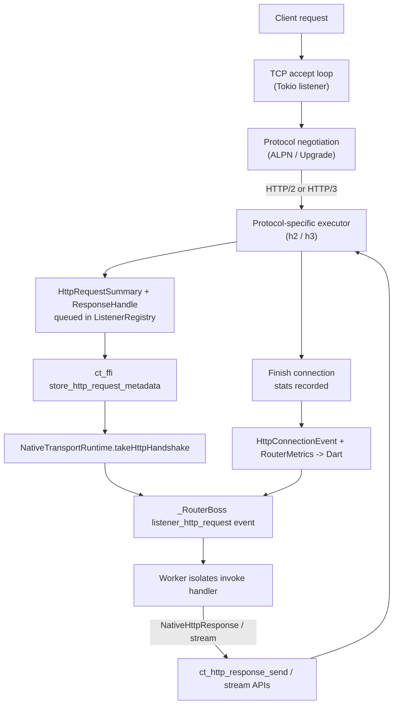

# Router Architecture & Data Flow

This document summarizes the current routing stack, the primary code locations, and the major initiatives already tracked in `ROADMAP.md`. The diagrams use Mermaid to visualize both the layered components and a typical HTTP ingestion workflow.

## Layered View

```mermaid
graph LR
    subgraph Clients
        A["Web/WAMP Clients"]
    end
    subgraph OS
        B["TCP/UDP Sockets"]
    end
    subgraph NativeRuntime["ct_core (Rust)"]
        C["Tokio Runtime\n(native/transport/ct_core/src/lib.rs)"]
        D["Negotiation Layer\n(RawSocket/WebSocket/HTTP)"]
        E["Protocol Executors\nHTTP1/2/3, QUIC, h2"]
        F["Streaming & Metrics\nhttp_stream.rs, http_body.rs"]
    end
    subgraph FFI["ct_ffi"]
        G["State Stores & Handles\nnative/transport/ct_ffi/src/runtime"]
    end
    subgraph DartRuntime["connectanum_router (Dart)"]
        H["NativeTransportRuntime\npackages/connectanum_router/lib/src/native"]
        I["_RouterBoss + Workers\nrouter_instance/router_boss.dart"]
        J["RouterStateStore & Metrics"]
        K["Application Handlers\n(worker isolates)"]
    end

    A --> B --> C --> D --> E --> F --> G --> H --> I --> K
    I --> J
    K -->|Responses/Events| I --> H --> G --> F
```

### Current Responsibilities

- **Tokio runtime & ListenerRegistry (`ct_core/src/lib.rs`)**  
  Binds sockets, negotiates protocols, and spawns per-protocol tasks (RawSocket, WebSocket, HTTP/1.1 handshakes, HTTP/2 via `h2`, HTTP/3 via `quinn + h3`). Every connection gets a `HttpConnectionStats` instance that now records idle/body timeouts, GOAWAY, and backpressure depth.

- **Streaming primitives (`http_stream.rs`, `http_body.rs`)**  
  Provide zero-copy handles for inbound bodies and outbound responses. HTTP/2 and HTTP/3 readers use the shared `StreamingBodyState`, while response writers use bounded Tokio channels sized by `RESPONSE_STREAM_BUFFER`.

- **FFI surface (`ct_ffi/src/runtime`)**  
  Stores every handshake/body/stream in lock-free maps and exposes them as integer handles (`ct_connection_take_http_handshake`, `ct_http_body_stream_read`, etc.). Lifecycle telemetry (`ct_connection_poll_http_event`) and aggregate counters (`ct_router_metrics_snapshot`) flow through the same layer. Test-only helpers (feature `ffi-test`) let us seed HTTP/3 handshakes/events directly from Rust integration tests.

- **Dart bindings (`packages/connectanum_router/lib/src/native`)**  
  `NativeTransportRuntime` loads the shared library, wires callbacks, and converts raw structs into Dart objects (`NativeHttpHandshake`, `NativeHttpConnectionEvent`, `NativeRouterMetrics`). The runtime is protocol-agnostic: any new native symbol must be added to `ffi_bindings.dart`.

- **Router boss/worker (`packages/connectanum_router/lib/src/router/router_instance/router_boss.dart`)**  
  The boss isolate accepts connections, assigns them to workers, drains HTTP requests, watches lifecycle events, and now emits a `router_metrics` event whenever the aggregated counters change. Workers own the actual WAMP sessions and execute application handlers.

## HTTP Workflow (current)

- **Metrics loop:** Every connection teardown pushes an event into `ListenerRegistry.connection_events`. The new `http_metrics_snapshot()` aggregates totals across the runtime; `ct_router_metrics_snapshot` lifts it to Dart, where `_RouterBoss` emits a `router_metrics` event on change.  
  Per-listener/protocol breakdowns are exposed via `http_metrics_snapshot_with_breakdown()` and cached in the boss telemetry stream so `_MetricsService` can publish them over OpenMetrics/WAMP or the HTTP metrics endpoint (with optional auth token) for Prometheus scraping.
- **Backpressure accounting:** Whenever pending HTTP queues exceed one item, `HttpConnectionStats::record_backpressure` increments the counter and tracks the largest depth. This information is available both per-event and in the aggregate snapshot.

## Planned Enhancements
| Roadmap Theme | Description | Status |
| --- | --- | --- |
| Multi-protocol listener stack | Unified accept loop with ALPN/Upgrade, surfacing serializer/subprotocol data. | 🔄 Planned (ROADMAP “Multi-protocol listener stack”) |
| HTTP pipeline completion | HTTP/1.1 zero-copy bodies, full HTTP/2 server, WebSocket upgrade pipeline, request/response streaming E2E. | 🧭 Partially done (HTTP/3 + streaming in place; remaining bullets tracked in ROADMAP) |
| Lifecycle telemetry & metrics | Connection events, GOAWAY/backpressure counters, boss-side metrics stream. | ✅ Current doc covers completed work; roadmap still calls for richer telemetry consumers. |
| WebSocket transport completion | Frame reader/writer bridging into RawSocket/WAMP, subprotocol negotiation. | 🧭 Partially done (native reader/writer path + masked WAMP regression added; Dart routing/tests pending) |
| HTTP streaming regression | listen_flow + router integration harness covering HTTP/1.1/HTTP/2/HTTP/3 zero-copy streaming. | 🧭 Native listen_flow now exercises HTTP/3 handshakes/streams under QUIC ALPN with WebPKI clients, and `router_integration_native_test.dart` drives HTTPS + HTTP/2 over native TLS plus HTTP/3 streaming via the QUIC test helper running off the main isolate. |
| HTTP routing bridge | Translation tables, reserved realms/namespaces, STR auth bridge. | 🔄 Planned |
| Serializer interop | JSON ↔ MessagePack ↔ CBOR bridging without copies. | 🔄 Planned |
| Benchmarks & docs | Harness, auth docs, example gallery. | 🧭 Dart HTTP bench runner + Rust orchestrator scaffold checked in; scenario driver + load generators still pending. |

Refer back to `ROADMAP.md` for the authoritative, living checklist—the entries above simply highlight where each initiative maps onto this structural diagram.

Feel free to update this document as new components (e.g., WebTransport, benchmark harnesses) ship—keeping the architectural diagrams fresh makes onboarding and roadmap discussions much easier.

### Benchmark Harness Components

- `packages/connectanum_bench/tool/bench_main.dart` – boots the router using the configuration from `bench_router.json`, spins up the native runtime, and now registers `/bench/*` HTTP control handlers (health check, stop, metrics snapshot + OpenMetrics payload, streaming echo) alongside their WAMP equivalents so both HTTP callers and embedded sessions can reuse the same code path.
- `bench_router.json` – default listener/realm configuration used by the bench runner. It binds `127.0.0.1:8080`, enables RawSocket + HTTP/2, and maps HTTP routes to the internal procedures described above.
- `native/bench/src/bin/http_stream.rs` – Rust CLI orchestrator that spawns the Dart runner, validates `/bench/*` control endpoints, parses TOML scenarios, drives HTTP/2 workloads via `hyper` prior-knowledge streams **and HTTP/3 workloads via `quinn` + `h3`** (QUIC prior knowledge), captures `binding.collectMetrics()` snapshots (plus the OpenMetrics text) before/after each workload, enforces per-workload timeouts (`--workload-timeout-ms`) so hung regressions fail fast, and emits JSONL summaries (`bench_results.jsonl`, including `open_metrics_before`/`open_metrics_after`) so CI/prom tooling can diff latency/throughput deltas.
- `native/bench/scenarios/h2_smoke.toml` – reference scenario file defining warm-up/load workloads (iterations, concurrency, payload sizes, chunking) used during harness bring-up.
